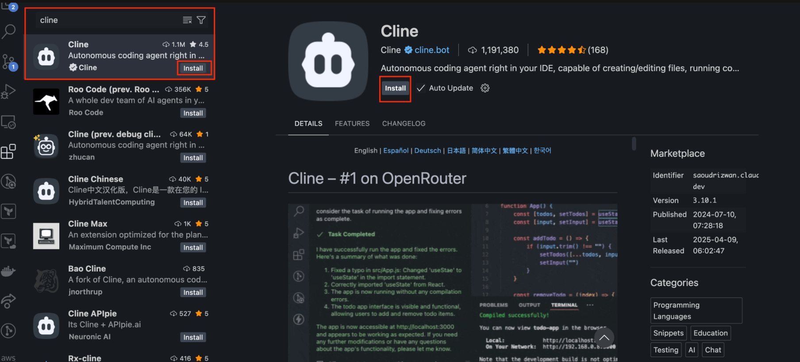
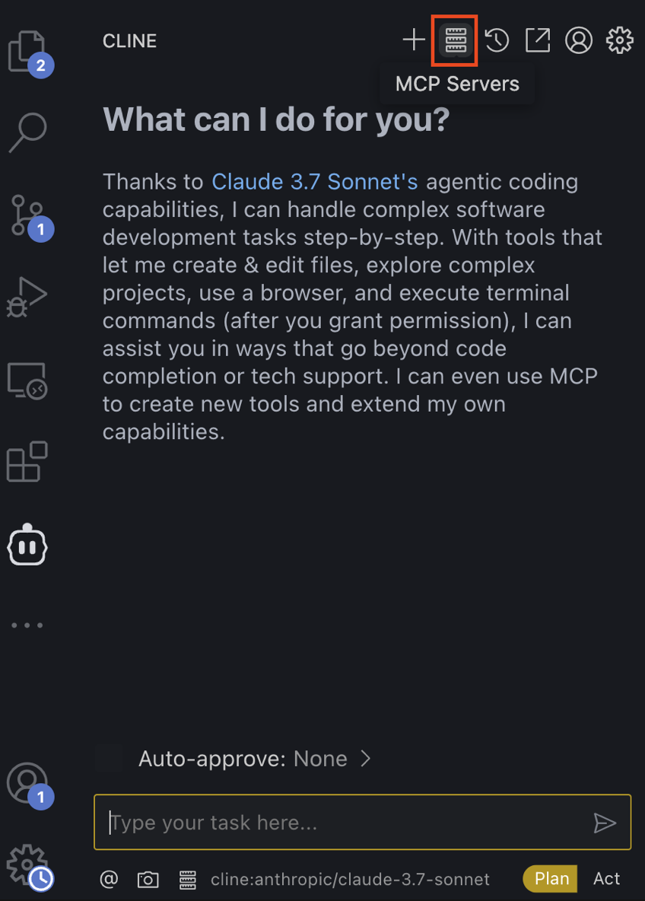
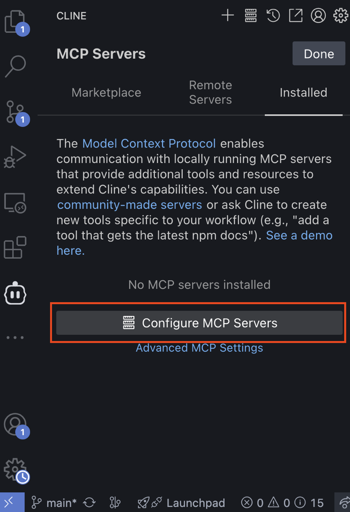
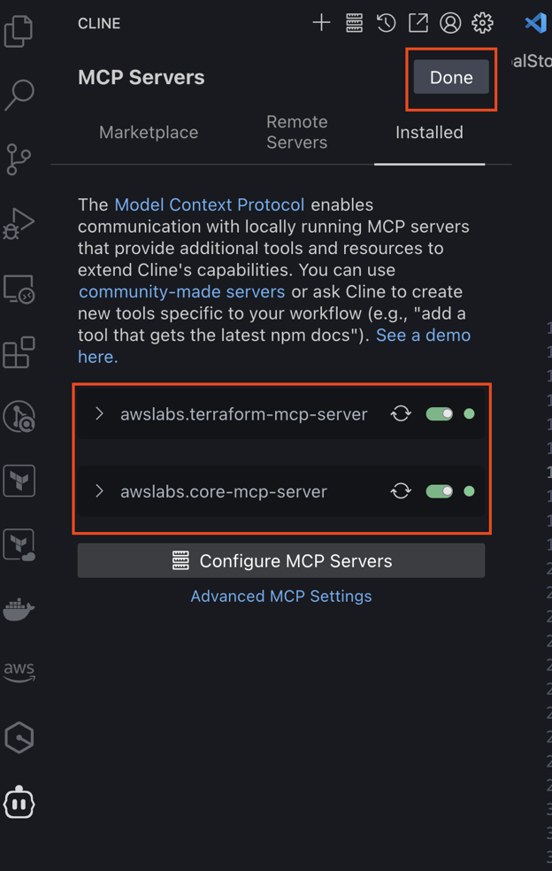
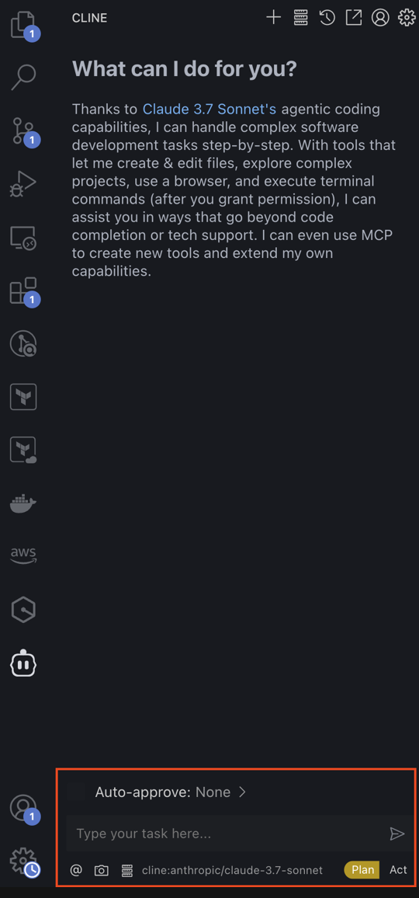
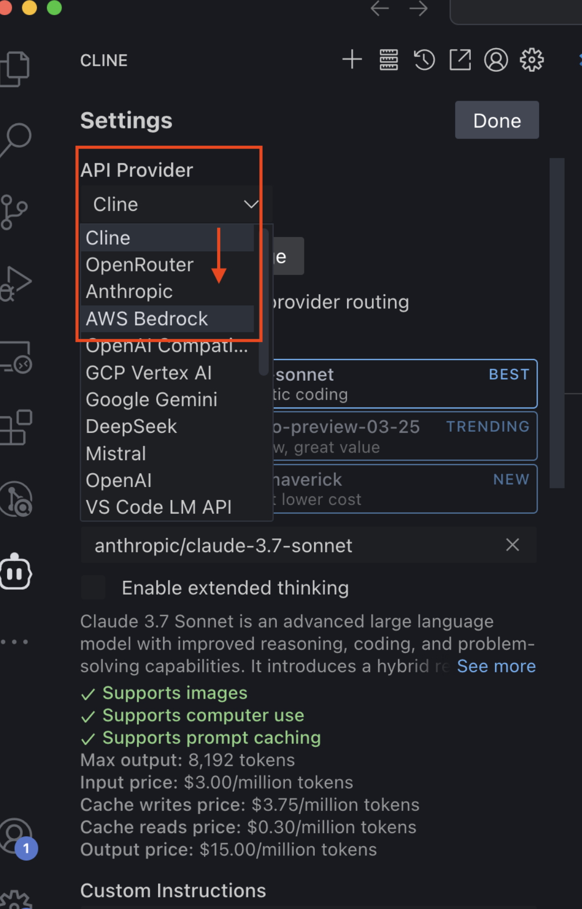
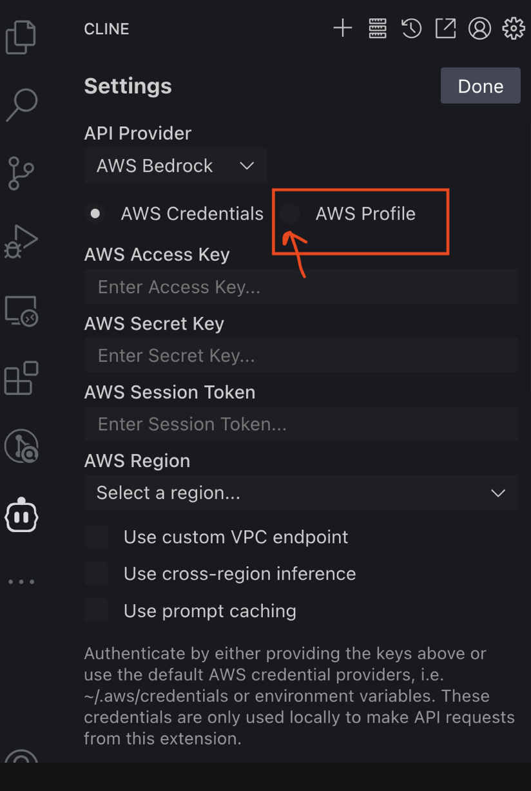
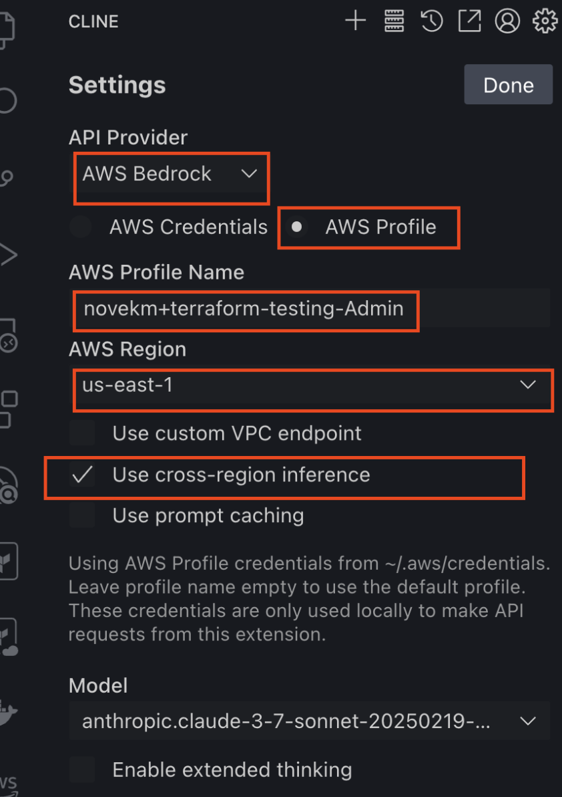
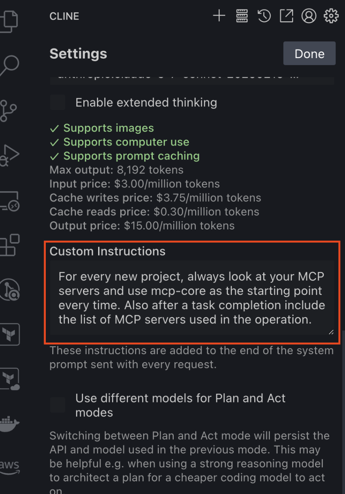

# AWS MCP Servers

A suite of specialized MCP servers that help you get the most out of AWS, wherever you use MCP.

[](https://github.com/awslabs/mcp)
[](LICENSE)

## Available Servers

This monorepo contains the following MCP servers:

### Core MCP Server

[](https://pypi.org/project/awslabs.core-mcp-server/)

A server for managing and coordinating other AWS Labs MCP servers.

- Automatic MCP Server Management
- Planning and guidance to orchestrate AWS Labs MCP Servers
- UVX Installation Support
- Centralized Configuration

[Learn more](src/core-mcp-server/README.md) | [Documentation](https://awslabs.github.io/mcp/servers/core-mcp-server/)

### AWS Documentation MCP Server

[](https://pypi.org/project/awslabs.aws-documentation-mcp-server/)

A server for accessing AWS documentation and best practices.

- Search Documentation using the official AWS search API
- Get content recommendations for AWS documentation pages
- Convert documentation to markdown format

[Learn more](src/aws-documentation-mcp-server/README.md) | [Documentation](https://awslabs.github.io/mcp/servers/aws-documentation-mcp-server/)

### Amazon Bedrock Knowledge Bases Retrieval MCP Server

[](https://pypi.org/project/awslabs.bedrock-kb-retrieval-mcp-server/)

A server for accessing Amazon Bedrock Knowledge Bases.

- Discover knowledge bases and their data sources
- Query knowledge bases with natural language
- Filter results by data source
- Rerank results

[Learn more](src/bedrock-kb-retrieval-mcp-server/README.md) | [Documentation](https://awslabs.github.io/mcp/servers/bedrock-kb-retrieval-mcp-server/)

### AWS CDK MCP Server

[](https://pypi.org/project/awslabs.cdk-mcp-server/)

A server for AWS CDK best practices.

- AWS CDK project analysis and assistance
- CDK construct recommendations
- Infrastructure as Code best practices

[Learn more](src/cdk-mcp-server/README.md) | [Documentation](https://awslabs.github.io/mcp/servers/cdk-mcp-server/)

### Cost Analysis MCP Server

[](https://pypi.org/project/awslabs.cost-analysis-mcp-server/)

A server for AWS Cost Analysis.

- Analyze and visualize AWS costs
- Query cost data with natural language
- Generate cost reports and insights

[Learn more](src/cost-analysis-mcp-server/README.md) | [Documentation](https://awslabs.github.io/mcp/servers/cost-analysis-mcp-server/)

### Amazon Nova Canvas MCP Server

[](https://pypi.org/project/awslabs.nova-canvas-mcp-server/)

A server for generating images using Amazon Nova Canvas.

- Text-based image generation with customizable parameters
- Color-guided image generation with specific palettes
- Workspace integration for saving generated images
- AWS authentication through profiles

[Learn more](src/nova-canvas-mcp-server/README.md) | [Documentation](https://awslabs.github.io/mcp/servers/nova-canvas-mcp-server/)

### AWS Diagram MCP Server

[](https://pypi.org/project/awslabs.aws-diagram-mcp-server/)

A server for seamlessly creating diagrams using the Python diagrams package DSL.

- Generate professional diagrams using Python code
- Support for AWS architecture, sequence diagrams, flow charts, and class diagrams
- Customize diagram appearance, layout, and styling
- Code scanning to ensure secure diagram generation

[Learn more](src/aws-diagram-mcp-server/README.md) | [Documentation](https://awslabs.github.io/mcp/servers/aws-diagram-mcp-server/)

### AWS Lambda MCP Server

[](https://pypi.org/project/awslabs.lambda-mcp-server/)

An server to select and run AWS Lambda function as MCP tools without code changes.

- This server acts as a bridge between MCP clients and AWS Lambda functions, allowing foundation models (FMs) to access and run Lambda functions as tools.
- This can be used, for example, to access private resources such as internal applications and databases without the need to provide public network access.
- This approach allows an MCP client to use other AWS services, private networks, and the public internet.
- The Lambda function description is used by MCP to describe the tool and should guide the FMs on when (what does the function provide?) and how (which parameters it needs? which syntax?) to use it.

[Learn more](src/lambda-mcp-server/README.md) | [Documentation](https://awslabs.github.io/mcp/servers/lambda-mcp-server/)

### AWS Terraform MCP Server

[](https://pypi.org/project/awslabs.terraform-mcp-server/)

A server for AWS Terraform best practices.

- Security-First Development Workflow
- Checkov Integration
- AWS and AWSCC Provider Documentation
- AWS-IA GenAI Modules
- Terraform Workflow Execution

[Learn more](src/terraform-mcp-server/README.md) | [Documentation](https://awslabs.github.io/mcp/servers/terraform-mcp-server/)

## What is the Model Context Protocol (MCP) and how does it work with AWS MCP Servers?

> The Model Context Protocol (MCP) is an open protocol that enables seamless integration between LLM applications and external data sources and tools. Whether you're building an AI-powered IDE, enhancing a chat interface, or creating custom AI workflows, MCP provides a standardized way to connect LLMs with the context they need.
>
> &mdash; [Model Context Protocol README](https://github.com/modelcontextprotocol#:~:text=The%20Model%20Context,context%20they%20need.)

AWS MCP Servers use this protocol to provide AI applications access to AWS documentation, contextual guidance, and best practices. Through the standardized MCP client-server architecture, AWS capabilities become an intelligent extension of your development environment or AI application.

For example, you can use the **AWS Documentation MCP Serve**r to help your AI assistant research and generate code for any AWS service, like Amazon Bedrock Inline agents. Alternatively, you could use the **CDK MCP Server** to have your AI assistant create infrastructure-as-code implementations that use the latest AWS CDK APIs and follow AWS best practices.

AWS MCP servers enable enhanced cloud-native development, infrastructure management, and development workflows—making AI-assisted cloud computing more accessible and efficient.

The Model Context Protocol is an open source project run by Anthropic, PBC. and open to contributions from the entire community.

## Installation and Setup

Each server has specific installation instructions. Generally, you can:

1. Install `uv` from [Astral](https://docs.astral.sh/uv/getting-started/installation/)
2. Install Python using `uv python install 3.10`
3. Configure AWS credentials with access to required services
4. Add the server to your MCP client configuration

Example configuration for Amazon Q CLI MCP (`~/.aws/amazonq/mcp.json`):

```json
{
  "mcpServers": {
    "awslabs.core-mcp-server": {
      "command": "uvx",
      "args": ["awslabs.core-mcp-server@latest"],
      "env": {
        "FASTMCP_LOG_LEVEL": "ERROR",
        "MCP_SETTINGS_PATH": "path to your mcp settings file"
      }
    },
    "awslabs.nova-canvas-mcp-server": {
      "command": "uvx",
      "args": ["awslabs.nova-canvas-mcp-server@latest"],
      "env": {
        "AWS_PROFILE": "your-aws-profile",
        "AWS_REGION": "us-east-1",
        "FASTMCP_LOG_LEVEL": "ERROR"
      }
    },
    "awslabs.bedrock-kb-retrieval-mcp-server": {
      "command": "uvx",
      "args": ["awslabs.bedrock-kb-retrieval-mcp-server@latest"],
      "env": {
        "AWS_PROFILE": "your-aws-profile",
        "AWS_REGION": "us-east-1",
        "FASTMCP_LOG_LEVEL": "ERROR"
      }
    },
    "awslabs.cost-analysis-mcp-server": {
      "command": "uvx",
      "args": ["awslabs.cost-analysis-mcp-server@latest"],
      "env": {
        "AWS_PROFILE": "your-aws-profile",
        "FASTMCP_LOG_LEVEL": "ERROR"
      }
    },
    "awslabs.cdk-mcp-server": {
      "command": "uvx",
      "args": ["awslabs.cdk-mcp-server@latest"],
      "env": {
        "FASTMCP_LOG_LEVEL": "ERROR"
      }
    },
    "awslabs.aws-documentation-mcp-server": {
      "command": "uvx",
      "args": ["awslabs.aws-documentation-mcp-server@latest"],
      "env": {
        "FASTMCP_LOG_LEVEL": "ERROR"
      },
      "disabled": false,
      "autoApprove": []
    },
    "awslabs.lambda-mcp-server": {
      "command": "uvx",
      "args": ["awslabs.lambda-mcp-server@latest"],
      "env": {
        "AWS_PROFILE": "your-aws-profile",
        "AWS_REGION": "us-east-1",
        "FUNCTION_PREFIX": "your-function-prefix",
        "FUNCTION_LIST": "your-first-function, your-second-function",
        "FUNCTION_TAG_KEY": "your-tag-key",
        "FUNCTION_TAG_VALUE": "your-tag-value"
      }
    }
  }
}
```

See individual server READMEs for specific requirements and configuration options.

## Getting Started with Cline and Amazon Bedrock
**IMPORTANT:** Following these instructions may incur costs and are subject to the [Amazon Bedrock Pricing](https://aws.amazon.com/bedrock/pricing/). You are responsible for any associated costs. In addition to selecting the desired model in the Cline settings, ensure you have your selected model (e.g. `anthropic.claude-3-7-sonnet`) also enabled in Amazon Bedrock. For more information on this, see [these AWS docs](https://docs.aws.amazon.com/bedrock/latest/userguide/model-access-modify.html) on enabling model access to Amazon Bedrock Foundation Models (FMs).


1. Follow the steps above in the **Installation and Setup** section to install `uv` from [Astral], install Python, and configure AWS credentials with the required services.

2. If using Visual Studio Code, install the [Cline VS Code Extension](https://marketplace.visualstudio.com/items?itemName=saoudrizwan.claude-dev) (or equivalent extension for your preferred IDE). Once installed, click the extension to open it. When prompted, select the tier that you wish. In this case, we will be using Amazon Bedrock, so the free tier of Cline is fine as we will be sending requests using the Amazon Bedrock API instead of the Cline API.



3. Select the **MCP Servers** button.



4. Select the **Installed** tab, then click **Configure MCP Servers** to open the `cline_mcp_settings.json` file.



5. In the `cline_mcp_settings.json` file, add your desired MCP servers in the `mcpServers` object. See the following example that will use all of the current AWS MCP servers that are available in this repository. Ensure you save the file to install the MCP servers.

### `cline_mcp_settings.json`
```json
{
  "mcpServers": {
    "awslabs.core-mcp-server": {
      "command": "uvx",
      "args": ["awslabs.core-mcp-server@latest"],
      "env": {
        "FASTMCP_LOG_LEVEL": "ERROR",
        "MCP_SETTINGS_PATH": "path to your mcp settings file"
      }
    },
    "awslabs.nova-canvas-mcp-server": {
      "command": "uvx",
      "args": ["awslabs.nova-canvas-mcp-server@latest"],
      "env": {
        "AWS_PROFILE": "your-aws-profile",
        "AWS_REGION": "us-east-1",
        "FASTMCP_LOG_LEVEL": "ERROR"
      }
    },
    "awslabs.bedrock-kb-retrieval-mcp-server": {
      "command": "uvx",
      "args": ["awslabs.bedrock-kb-retrieval-mcp-server@latest"],
      "env": {
        "AWS_PROFILE": "your-aws-profile",
        "AWS_REGION": "us-east-1",
        "FASTMCP_LOG_LEVEL": "ERROR"
      }
    },
    "awslabs.cost-analysis-mcp-server": {
      "command": "uvx",
      "args": ["awslabs.cost-analysis-mcp-server@latest"],
      "env": {
        "AWS_PROFILE": "your-aws-profile",
        "FASTMCP_LOG_LEVEL": "ERROR"
      }
    },
    "awslabs.cdk-mcp-server": {
      "command": "uvx",
      "args": ["awslabs.cdk-mcp-server@latest"],
      "env": {
        "FASTMCP_LOG_LEVEL": "ERROR"
      }
    },
    "awslabs.aws-documentation-mcp-server": {
      "command": "uvx",
      "args": ["awslabs.aws-documentation-mcp-server@latest"],
      "env": {
        "FASTMCP_LOG_LEVEL": "ERROR"
      },
      "disabled": false,
      "autoApprove": []
    },
    "awslabs.lambda-mcp-server": {
      "command": "uvx",
      "args": ["awslabs.lambda-mcp-server@latest"],
      "env": {
        "AWS_PROFILE": "your-aws-profile",
        "AWS_REGION": "us-east-1",
        "FUNCTION_PREFIX": "your-function-prefix",
        "FUNCTION_LIST": "your-first-function, your-second-function",
        "FUNCTION_TAG_KEY": "your-tag-key",
        "FUNCTION_TAG_VALUE": "your-tag-value"
      }
    },
    "awslabs.terraform-mcp-server": {
      "command": "uvx",
      "args": ["awslabs.terraform-mcp-server@latest"],
      "env": {
        "FASTMCP_LOG_LEVEL": "ERROR"
      },
      "disabled": false,
      "autoApprove": []
    },
  }
}
```

6. Once installed, you should see a list of your MCP Servers, and they should have a green slider to show that they are enabled. See the following for an example with two of the possible AWS MCP Servers. Click **Done** when finished. You should now see the Cline chat interface.




7. By default, Cline will be set as the API provider, which has limits for the free tier. Next, let’s update the API provider to be AWS Bedrock, so we can use the LLMs through Bedrock, which would have billing go through your connected AWS account.


8. Click the settings gear to open up the Cline settings. Then under **API Provider**, switch this from `Cline` to `AWS Bedrock` and select `AWS Profile` for the authentication type. As a note, the `AWS Credentials` option works as well, however it uses a static credentials (Access Key ID and Secret Access Key) instead of temporary credentials that are automatically redistributed when the token expires, so the temporary credentials with an AWS Profile is the more secure and recommended method.



9. Fill out the configuration based on the existing AWS Profile you wish to use, select the desired AWS Region, and enable cross-region inference.




10. Next, scroll down on the settings page until you reach the text box that says Custom Instructions. Paste in the following snippet to ensure the `mcp-core` server is used as the starting point for every prompt:

```
For every new project, always look at your MCP servers and use mcp-core as the starting point every time. Also after a task completion include the list of MCP servers used in the operation.
```



11. Once the custom prompt is pasted in, click **Done** to return to the chat interface.

12. Now you can begin asking questions and testing out the functionality of your installed AWS MCP Servers. The default option in the chat interface is is `Plan` which will provide the output for you to take manual action on (e.g. providing you a sample configuration that you copy and paste into a file). However, you can optionally toggle this to `Act` which will allow Cline to act on your behalf (e.g. searching for content using a web browser, cloning a repository, executing code, etc). You can optionally toggle on the “Auto-approve” section to avoid having to click to approve the suggestions, however we recommend leaving this off during testing, especially if you have the Act toggle selected.

**Note:** For the best results, please prompt Cline to use the desired AWS MCP Server you wish to use. For example, `Using the Terraform MCP Server, do...`

## Samples

Ready-to-use examples of AWS MCP Servers in action are available in the [samples](samples/) directory. These samples provide working code and step-by-step guides to help you get started with each MCP server.

## Documentation

Comprehensive documentation for all servers is available on our [documentation website](https://awslabs.github.io/mcp/).

Documentation for each server:

- [Core MCP Server](https://awslabs.github.io/mcp/servers/core-mcp-server/)
- [Amazon Bedrock Knowledge Bases Retrieval MCP Server](https://awslabs.github.io/mcp/servers/bedrock-kb-retrieval-mcp-server/)
- [AWS CDK MCP Server](https://awslabs.github.io/mcp/servers/cdk-mcp-server/)
- [Cost Analysis MCP Server](https://awslabs.github.io/mcp/servers/cost-analysis-mcp-server/)
- [Amazon Nova Canvas MCP Server](https://awslabs.github.io/mcp/servers/nova-canvas-mcp-server/)
- [AWS Diagram MCP Server](https://awslabs.github.io/mcp/servers/aws-diagram-mcp-server/)

Documentation includes:

- Detailed guides for each server
- Installation and configuration instructions
- API references
- Usage examples

## Security

See [CONTRIBUTING](CONTRIBUTING.md#security-issue-notifications) for more information.

## Contributing

Big shout out to our awesome contributors! Thank you for making this project better!

[](https://github.com/awslabs/mcp/graphs/contributors)

Contributions of all kinds are welcome! Check out our [contributor guide](CONTRIBUTING.md) for more information.

## Developer guide

If you want to add a new MCP Server to the library, check out our [development guide](DEVELOPER_GUIDE.md)

## License

This project is licensed under the Apache-2.0 License.

## Disclaimer

Before using an MCP Server, you should consider conducting your own independent assessment to ensure that your use would comply with your own specific security and quality control practices and standards, as well as the laws, rules, and regulations that govern you and your content.
