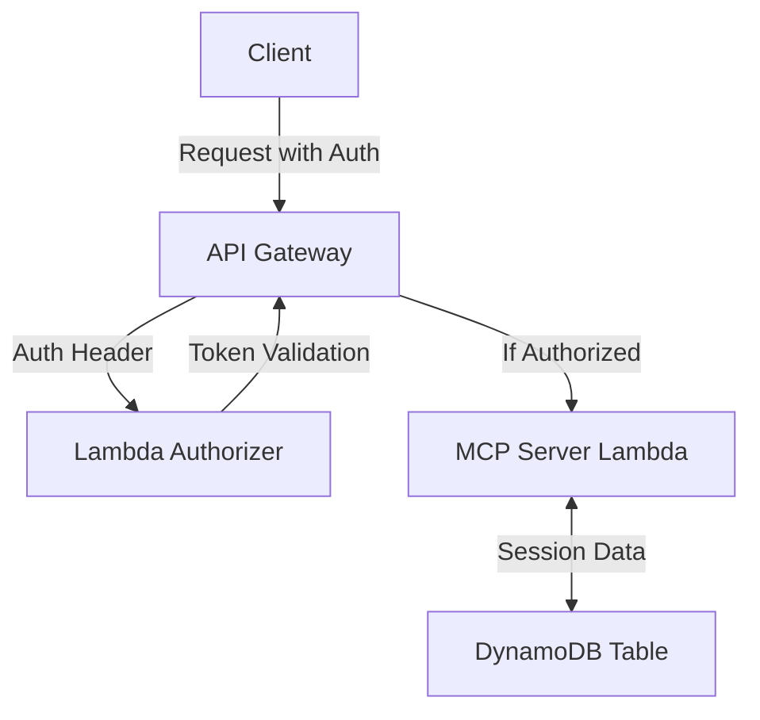

# MCP Lambda Handler Sample (AWS SAM)

This sample demonstrates how to deploy and run an MCP-compliant server using AWS Lambda and API Gateway, with session management in DynamoDB and a custom Lambda authorizer for authentication. The deployment is managed using the AWS SAM CLI.

## Architecture



- **API Gateway**: Exposes the `/mcp` endpoint, protected by a custom Lambda authorizer.
- **Lambda Authorizer**: Validates a bearer token in the `Authorization` header.
- **MCP Server Lambda**: Implements MCP tools and session logic.
- **DynamoDB**: Stores session data.

## Prerequisites

- [AWS SAM CLI](https://docs.aws.amazon.com/serverless-application-model/latest/developerguide/install-sam-cli.html)
- AWS account and credentials configured (see note below)
- Python 3.12

## Setup & Deployment

1. **Clone the repository** (if you haven't already):

   ```bash
   git clone https://github.com/awslabs/mcp.git
   cd mcp/samples/mcp-lambda-handler
   ```

2. **Build the SAM application:**

   ```bash
   sam build
   ```

3. **Deploy the stack:**

   You will be prompted for a value for `McpAuthToken` (a bearer token). For demo purposes, you can enter any string (e.g., `my-demo-token-321`).

   ```bash
   sam deploy --guided
   ```

   After deployment, note the API endpoint output by SAM (e.g., `https://...amazonaws.com/Prod/mcp`).

## Authentication (Bearer Token)

This sample uses a simple bearer token for authentication, checked by a Lambda authorizer. **For demo purposes only**, you can use any string as the token. When calling the API, include the following header:

```
Authorization: Bearer <your-demo-token>
```

> **Warning:** This authentication method is for demonstration only. For any serious or production use, consider integrating with a robust authentication provider such as [Amazon Cognito](https://aws.amazon.com/cognito/) or another secure mechanism.

## Usage

You can invoke the `/mcp` endpoint using [MCP Inspector](https://modelcontextprotocol.io/docs/tools/inspector) or via `curl`. Example:

```bash
curl -X POST \
  -H "Authorization: Bearer my-demo-token" \
  -H "Content-Type: application/json" \
  -d '{"input": "roll_dice", "parameters": {"sides": 6}}' \
  https://<your-api-id>.execute-api.<region>.amazonaws.com/Prod/mcp
```

Replace `<your-api-id>`, `<region>`, and `my-demo-token` with your actual values.

## Customizing and Adding Your Own Tools

The sample MCP server Lambda (in `server/app.py`) demonstrates how to define MCP tools using the `@mcp_server.tool()` decorator. You can add your own tools by creating new Python functions and decorating them in the same way. Each tool will be exposed via the MCP protocol at the `/mcp` endpoint.

**Tools included in this sample:**
- `roll_dice(sides: int = 6, be_nice: bool = False)`: Roll a dice with a configurable number of sides, with an option to avoid consecutive critical fails.
- `get_total_score()`: Get the total score from all dice rolls in the current session.
- `get_roll_history()`: Retrieve the history of all rolls in the current session.
- `reset_score()`: Reset the total score and roll history for the current session.

**To add your own tool:**
1. Open `server/app.py`.
2. Define a new function and decorate it with `@mcp_server.tool()`.
3. The function's name and docstring will be used by MCP clients for discovery and documentation.
4. Deploy your changes using `sam build` and `sam deploy`.

For more details, see the [MCP Lambda Handler documentation](../../src/mcp-lambda-handler/README.md).

## Cleanup

To remove all resources created by this sample:

```bash
sam delete
```

---

For more information, see the [Model Context Protocol documentation](https://modelcontextprotocol.io/) and the [AWS SAM CLI documentation](https://docs.aws.amazon.com/serverless-application-model/latest/developerguide/what-is-sam.html).
