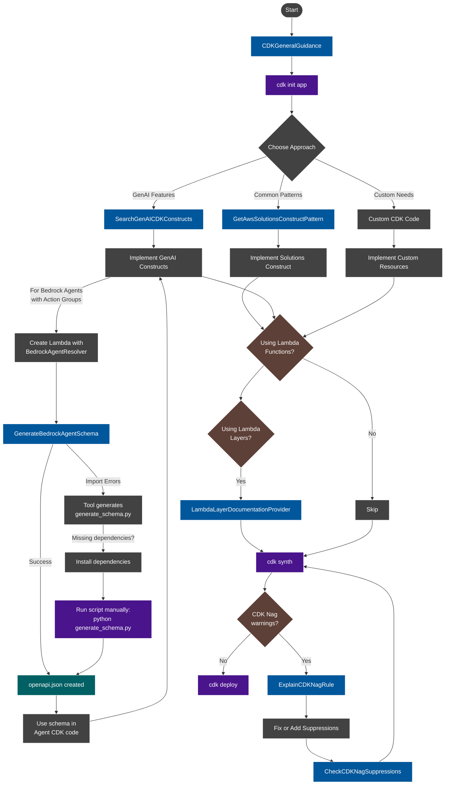

```mermaid
graph TD
    Start([Start]) --> A["CDKGeneralGuidance"]
    A --> Init["cdk init app"]

    Init --> B{Choose Approach}
    B -->|"Common Patterns"| C1["GetAwsSolutionsConstructPattern"]
    B -->|"GenAI Features"| C2["SearchGenAICDKConstructs"]
    B -->|"Custom Needs"| C3["Custom CDK Code"]

    C1 --> D1["Implement Solutions Construct"]
    C2 --> D2["Implement GenAI Constructs"]
    C3 --> D3["Implement Custom Resources"]

    %% Bedrock Agent with Action Groups specific flow
    D2 -->|"For Bedrock Agents<br/>with Action Groups"| BA["Create Lambda with<br/>BedrockAgentResolver"]

    %% Schema generation flow
    BA --> BS["GenerateBedrockAgentSchema"]
    BS -->|"Success"| JSON["openapi.json created"]
    BS -->|"Import Errors"| BSF["Tool generates<br/>generate_schema.py"]
    BSF -->|"Missing dependencies?"| InstallDeps["Install dependencies"]
    InstallDeps --> BSR["Run script manually:<br/>python generate_schema.py"]
    BSR --> JSON["openapi.json created"]

    %% Use schema in Agent CDK
    JSON --> AgentCDK["Use schema in<br/>Agent CDK code"]
    AgentCDK --> D2

    %% Conditional Lambda Powertools implementation
    D1 & D2 & D3 --> HasLambda{"Using Lambda<br/>Functions?"}
    HasLambda --> UseLayer{"Using Lambda<br/>Layers?"}
    UseLayer -->|"Yes"| LLDP["LambdaLayerDocumentationProvider"]

    HasLambda -->|"No"| SkipL["Skip"]

    %% Rest of workflow
    LLDP["LambdaLayerDocumentationProvider"] --> Synth["cdk synth"]
    SkipL --> Synth

    Synth --> Nag{"CDK Nag<br/>warnings?"}
    Nag -->|Yes| E["ExplainCDKNagRule"]
    Nag -->|No| Deploy["cdk deploy"]

    E --> Fix["Fix or Add Suppressions"]
    Fix --> CN["CheckCDKNagSuppressions"]
    CN --> Synth

    %% Styling with darker colors
    classDef default fill:#424242,stroke:#ffffff,stroke-width:1px,color:#ffffff;
    classDef cmd fill:#4a148c,stroke:#ffffff,stroke-width:1px,color:#ffffff;
    classDef tool fill:#01579b,stroke:#ffffff,stroke-width:1px,color:#ffffff;
    classDef note fill:#1b5e20,stroke:#ffffff,stroke-width:1px,color:#ffffff;
    classDef output fill:#006064,stroke:#ffffff,stroke-width:1px,color:#ffffff;
    classDef decision fill:#5d4037,stroke:#ffffff,stroke-width:1px,color:#ffffff;

    class Init,Synth,Deploy,BSR cmd;
    class A,C1,C2,BS,E,CN,LLDP tool;
    class JSON output;
    class HasLambda,UseLayer,Nag decision;
```
