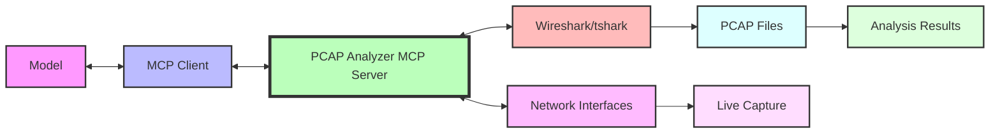

# PCAP Analyzer MCP Server

A Model Context Protocol (MCP) server for comprehensive network packet capture and analysis using Wireshark/tshark. This server provides 31 specialized tools across 8 categories for deep network analysis, troubleshooting, and security assessment.

## Features

This MCP server acts as a **bridge** between MCP clients and network analysis tools, allowing generative AI models to perform sophisticated packet capture and analysis tasks. The server provides a comprehensive suite of network analysis capabilities while maintaining proper security controls and file management.



From a **security** perspective, this server implements safe file handling and controlled network access to ensure that only authorized packet capture and analysis operations are performed.

## Key Capabilities

### 🔧 Network Interface Management (1 tool)
- **list_network_interfaces**: Discover available network interfaces for packet capture

### 📡 Packet Capture Management (4 tools)
- **start_packet_capture**: Initiate live packet capture with customizable filters
- **stop_packet_capture**: Stop active capture sessions
- **get_capture_status**: Monitor active capture sessions
- **list_captured_files**: Browse captured PCAP files

### 🔍 Basic PCAP Analysis (4 tools)
- **analyze_pcap_file**: Generate comprehensive packet analysis summaries
- **extract_http_requests**: Extract and analyze HTTP traffic
- **generate_traffic_timeline**: Create temporal traffic analysis
- **search_packet_content**: Search for specific patterns in packet data

### ⚡ Network Performance Analysis (2 tools)
- **analyze_network_performance**: Assess network performance metrics
- **analyze_network_latency**: Measure and analyze network latency

### 🔒 TLS/SSL Security Analysis (6 tools)
- **analyze_tls_handshakes**: Examine TLS handshake processes
- **analyze_sni_mismatches**: Detect SNI-related issues
- **extract_certificate_details**: Analyze SSL certificates
- **analyze_tls_alerts**: Investigate TLS alert messages
- **analyze_connection_lifecycle**: Track complete connection flows
- **extract_tls_cipher_analysis**: Analyze cipher suite negotiations

### 🌐 TCP Protocol Analysis (5 tools)
- **analyze_tcp_retransmissions**: Detect packet loss and retransmissions
- **analyze_tcp_zero_window**: Identify flow control issues
- **analyze_tcp_window_scaling**: Examine window scaling behavior
- **analyze_packet_timing_issues**: Detect timing-related problems
- **analyze_congestion_indicators**: Assess network congestion

### 🔬 Advanced Network Analysis (5 tools)
- **analyze_dns_resolution_issues**: Troubleshoot DNS problems
- **analyze_expert_information**: Leverage Wireshark expert analysis
- **analyze_protocol_anomalies**: Detect protocol violations
- **analyze_network_topology**: Map network structure
- **analyze_security_threats**: Identify potential security issues

### 📊 Performance & Quality Metrics (4 tools)
- **generate_throughput_io_graph**: Create throughput visualizations
- **analyze_bandwidth_utilization**: Monitor bandwidth usage
- **analyze_application_response_times**: Measure application performance
- **analyze_network_quality_metrics**: Assess overall network quality

## Prerequisites

1. Install `uv` from [Astral](https://docs.astral.sh/uv/getting-started/installation/) or the [GitHub README](https://github.com/astral-sh/uv#installation)
2. Install Python using `uv python install 3.10`
3. Install Wireshark/tshark on your system:
   - **macOS**: `brew install wireshark`
   - **Ubuntu/Debian**: `sudo apt-get install tshark`
   - **Windows**: Download from [Wireshark.org](https://www.wireshark.org/download.html)
4. Ensure proper permissions for packet capture (may require sudo/administrator privileges)

## Setup

### System Configuration

For packet capture functionality, you may need to configure system permissions:

#### macOS
```bash
# Add user to access_bpf group (may require restart)
sudo dseditgroup -o edit -a $(whoami) -t user access_bpf
```

#### Linux
```bash
# Allow non-root packet capture
sudo setcap cap_net_raw,cap_net_admin=eip /usr/bin/dumpcap
```

#### Windows
Run as Administrator or ensure WinPcap/Npcap is properly installed.

### Installation

| Cursor | VS Code |
|:------:|:-------:|
| [](https://cursor.com/en/install-mcp?name=awslabs.pcap-analyzer-mcp-server&config=eyJjb21tYW5kIjoidXZ4IGF3c2xhYnMucGNhcC1hbmFseXplci1tY3Atc2VydmVyQGxhdGVzdCIsImVudiI6eyJGQVNUTUNQX0xPR19MRVZFTCI6IkVSUk9SIn0sImRpc2FibGVkIjpmYWxzZSwiYXV0b0FwcHJvdmUiOltdfQ%3D%3D) | [](https://insiders.vscode.dev/redirect/mcp/install?name=PCAP%20Analyzer%20MCP%20Server&config=%7B%22command%22%3A%22uvx%22%2C%22args%22%3A%5B%22awslabs.pcap-analyzer-mcp-server%40latest%22%5D%2C%22env%22%3A%7B%22FASTMCP_LOG_LEVEL%22%3A%22ERROR%22%7D%2C%22disabled%22%3Afalse%2C%22autoApprove%22%3A%5B%5D%7D) |

#### Amazon Q Developer

Configure the MCP server in your MCP client configuration (e.g., for Amazon Q Developer CLI, edit `~/.aws/amazonq/mcp.json`):

```json
{
  "mcpServers": {
    "awslabs.pcap-analyzer-mcp-server": {
      "command": "uvx",
      "args": ["awslabs.pcap-analyzer-mcp-server@latest"],
      "env": {
        "FASTMCP_LOG_LEVEL": "ERROR"
      }
    }
  }
}
```

### Windows Installation

For Windows users, the MCP server configuration format is slightly different:

```json
{
  "mcpServers": {
    "awslabs.pcap-analyzer-mcp-server": {
      "disabled": false,
      "timeout": 60,
      "type": "stdio",
      "command": "uv",
      "args": [
        "tool",
        "run",
        "--from",
        "awslabs.pcap-analyzer-mcp-server@latest",
        "awslabs.pcap-analyzer-mcp-server.exe"
      ],
      "env": {
        "FASTMCP_LOG_LEVEL": "ERROR"
      }
    }
  }
}
```

#### Docker
First build the image `docker build -t awslabs/pcap-analyzer-mcp-server .`:

```json
{
  "mcpServers": {
    "awslabs.pcap-analyzer-mcp-server": {
      "command": "docker",
      "args": [
        "run",
        "--rm",
        "--interactive",
        "--net=host",
        "--cap-add=NET_RAW",
        "--cap-add=NET_ADMIN",
        "awslabs/pcap-analyzer-mcp-server:latest"
      ],
      "env": {},
      "disabled": false,
      "autoApprove": []
    }
  }
}
```

#### Kiro

At the project level `.kiro/settings/mcp.json`

```json
{
  "mcpServers": {
    "awslabs.pcap-analyzer-mcp-server": {
      "command": "uvx",
      "args": ["awslabs.pcap-analyzer-mcp-server@latest"],
      "env": {
        "FASTMCP_LOG_LEVEL": "ERROR"
      }
    }
  }
}
```

#### Claude Desktop

```json
{
  "mcpServers": {
    "awslabs.pcap-analyzer-mcp-server": {
      "command": "uvx",
      "args": ["awslabs.pcap-analyzer-mcp-server@latest"],
      "env": {
        "FASTMCP_LOG_LEVEL": "ERROR"
      }
    }
  }
}
```

## Usage Examples

### Basic Network Analysis
```
"Analyze the network traffic in sample.pcap and identify any performance issues"
```

### Security Assessment
```
"Capture network traffic for 60 seconds and analyze for potential security threats"
```

### TLS Troubleshooting
```
"Examine TLS handshakes in the capture file and identify any certificate issues"
```

### Performance Monitoring
```
"Generate a throughput analysis for the last hour of network traffic"
```

## Server Configuration Options

The PCAP Analyzer MCP Server supports several configuration options through environment variables:

### `PCAP_STORAGE_DIR`
Specify the directory for storing captured PCAP files. Default is `./pcap_storage`.

### `MAX_CAPTURE_DURATION`
Set the maximum allowed capture duration in seconds. Default is 3600 (1 hour).

### `WIRESHARK_PATH`
Override the default Wireshark/tshark installation path.

Example:
```bash
PCAP_STORAGE_DIR=/tmp/pcaps MAX_CAPTURE_DURATION=1800 uvx awslabs.pcap-analyzer-mcp-server@latest
```

## Best Practices

### Network Analysis
- Start with basic analysis before diving into specific protocols
- Use appropriate capture filters to focus on relevant traffic
- Consider privacy and legal implications when capturing network traffic
- Store PCAP files securely and delete when no longer needed

### Performance Optimization
- Limit capture duration for large networks
- Use display filters to focus analysis on specific issues
- Monitor system resources during intensive analysis operations

### Security Considerations
- Only capture traffic you have permission to analyze
- Be aware of sensitive data in packet captures
- Use secure storage for PCAP files containing sensitive information
- Follow organizational policies for network monitoring

## Troubleshooting

### Permission Issues
- **Linux/macOS**: Ensure proper capabilities are set for packet capture
- **Windows**: Run with administrator privileges or install WinPcap/Npcap

### Wireshark Not Found
- Verify Wireshark/tshark is installed and in PATH
- Set `WIRESHARK_PATH` environment variable if needed

### Capture Issues
- Check network interface availability with `list_network_interfaces`
- Verify capture filters are syntactically correct
- Ensure sufficient disk space for PCAP files

### Analysis Errors
- Verify PCAP file integrity
- Check that analysis tools have sufficient memory
- Ensure display filters are valid Wireshark syntax

## Security Considerations

When using this MCP server, consider:

- **Network Access**: The server requires network interface access for packet capture
- **File System**: PCAP files are stored locally and may contain sensitive data
- **Permissions**: Packet capture typically requires elevated privileges
- **Privacy**: Ensure compliance with privacy laws and organizational policies
- **Data Retention**: Implement appropriate data retention and deletion policies

## Advanced Features

### Custom Analysis Scripts
The server supports integration with custom Wireshark Lua scripts for specialized analysis.

### Batch Processing
Multiple PCAP files can be analyzed in batch operations for comparative analysis.

### Export Formats
Analysis results can be exported in various formats including JSON, CSV, and XML.

## Contributing

This MCP server is part of the AWS Labs MCP project. For contributions, please refer to the main project guidelines.

## License

This project is licensed under the Apache License 2.0. See the LICENSE file for details.
