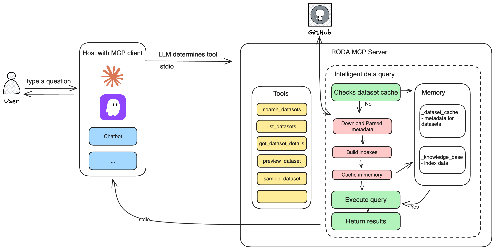

# Registry of Open Data on AWS (RODA) MCP Server

An Model Context Protocol (MCP) server for discovering and exploring datasets from the [Registry of Open Data on AWS (RODA)](https://registry.opendata.aws/). The registry hosts hundreds of publicly available datasets including climate data, genomics, satellite imagery, and more on Amazon Simple Storage Service (S3).

## Features

- Discover datasets across 1,000+ open datasets on AWS
- Search by keyword, organization, license, or topic in natural language
- Find related datasets and explore by domain
- License-aware — always surfaces compliance information
- Curated next steps on how to access datasets
- For public datasets without controlled access:
  - preview S3 bucket structure
  - sample file directly in conversation

## Prerequisites

1. Install `uv` from [Astral](https://docs.astral.sh/uv/getting-started/installation/)
1. Install Python 3.10+ using `uv python install 3.10`


## Available Tools

| Tool | Description |
|------|-------------|
| `search_datasets` | Search by keyword with optional filters for tags, organization, and license type |
| `list_datasets` | List all datasets with optional tag filtering |
| `get_dataset_details` | Get complete details for a specific dataset including resources and access info |
| `discover_by_organization` | Find datasets managed by a specific organization (e.g., NASA, NOAA) |
| `discover_by_license` | Find datasets by license type (e.g., Creative Commons, MIT) |
| `find_related_datasets` | Find datasets related to a given dataset based on shared tags |
| `get_knowledge_base_stats` | Get registry statistics including top tags, organizations, and resource types |
| `preview_dataset` | Show S3 bucket structure for datasets (no download, no AWS account needed). This is only available for public datasets without controlled access. You should review and agree to the dataset license before previewing datasets.|
| `sample_dataset` | Read the first 100KB of a specific file from a public dataset's S3 bucket. This is only available for public datasets without controlled access. You should review and agree to the dataset license before sampling datasets.|
| `search_stac_endpoints` | Find datasets with STAC (SpatioTemporal Asset Catalog) API endpoints |


## High-level Architecture

Open data providers onboard new datasets and provide updates to existing datasets using a structured YAML schema for dataset metadata (see example [here](https://github.com/awslabs/open-data-registry)). The YAML schema includes keys such as name, description, tags (a list of relevant topics), managedBy (provider organization), update frequency and resources (as part of access instructions). Every time an update is made (such as adding or updating data) in the Registry, an automated build is run to generate a parsed metadata file in ndjson format.

This MCP server uses this ndjson file to build an in-memory knowledge base. In particular, we build indexes for parsed data across different search categories, such as tags, keywords, and organizations, to provide fast and accurate retrieval of information based on the dataset’s metadata. Metadata information is cached for 24 hours for better performance, and the cache automatically refreshes after expiration.



Datasets on the Registry fall into three access tiers, due to different compliance reasons:
- Open and free; hosted in a public S3 bucket and don't require AWS account to use
- Open, but require AWS credentials and requester pay
- Controlled access, particularly in health domains, and requires additional steps to access the datasets

For the datasets that are open and free, we offer a preview into S3 buckets, as well as capability to sample a file to help users quickly evaluate the datasets. For other datasets, we provide access instructions to users on how to access the datasets.


## 🚀 Quick Start

### 1. Install

```bash
# Create virtual environment
python3 -m venv .venv

# Activate virtual environment
source .venv/bin/activate  # On Windows: .venv\Scripts\activate

# Install the package
pip install -e .
```

### 2. Configuration

For Kiro:

Add to `.kiro/settings/mcp.json`:

**Option A: Using uv**
```json
{
  "mcpServers": {
    "roda": {
      "command": "uv",
      "args": ["--directory", "/absolute/path/to/roda-mcp-server", "run", "-m", "awslabs.roda_mcp_server.server"],
      "disabled": false,
      "autoApprove": []
    }
  }
}
```

**Option B: Using Python**
```json
{
  "mcpServers": {
    "roda": {
      "command": "/absolute/path/to/roda-mcp-server/.venv/bin/python",
      "args": ["-m", "awslabs.roda_mcp_server.server"],
      "cwd": "/absolute/path/to/roda-mcp-server",
      "disabled": false,
      "autoApprove": []
    }
  }
}
```

For Claude Code:

Update `.mcp.json` (in this project root):
```json
  {
    "mcpServers": {
      "roda-mcp-server": {
        "command": "uv",
        "args": ["run", "--directory", "/absolute/path/to/roda-mcp-server",
  "roda-mcp-server"]
      }
    }
  }
```

### 3. Restart Kiro or Claude Code

Kiro: Open Command Palette → "Reconnect MCP Servers"

### 4. Test It

In Kiro/ Claude Code chat:
```
Search for climate datasets
Find datasets managed by NASA
```

## Security
Check out [Security](SECURITY.md) for security considerations on this MCP server.

## License
Copyright Amazon.com, Inc. or its affiliates. All Rights Reserved.

Licensed under the Apache License, Version 2.0 (the "License").


## Disclaimer
This roda-mcp-server package is provided "as is" without warranty of any kind, express or implied, and is intended for development, testing, and evaluation purposes only. We do not provide any guarantee on the quality, performance, or reliability of this package. LLMs are non-deterministic and they make mistakes, we advise you to always thoroughly test and follow the best practices of your organization before using these tools on customer facing accounts. Users of this package are solely responsible for implementing proper security controls and MUST use AWS Identity and Access Management (IAM) to manage access to AWS resources. You are responsible for configuring appropriate IAM policies, roles, and permissions, and any security vulnerabilities resulting from improper IAM configuration are your sole responsibility. By using this package, you acknowledge that you have read and understood this disclaimer and agree to use the package at your own risk.
